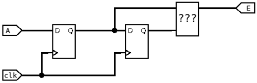

# TP FPGA – Écran magique

**Réalisé par :** Soltani Ezer & Ben Tekfa Maram

---

## Introduction

Ce projet de TP consiste à réaliser une version numérique du télécran sur FPGA, en utilisant la sortie HDMI de la carte DE10-Nano.  
Le déplacement du pixel est contrôlé par les deux encodeurs rotatifs de la carte mezzanine.

Le projet est réalisé en plusieurs étapes :  
- Gestion des encodeurs  
- Affichage HDMI  
- Déplacement d’un pixel  
- Mémorisation du tracé et effacement de l’écran  

---

## Gestion des encodeurs

Dans cette partie, nous avons travaillé sur deux signaux issus des encodeurs rotatifs : **A** et **B**.

**Objectif :**  
- Incrémenter la valeur d’un registre lorsque l’encodeur tourne vers la droite  
- Décrémenter cette valeur lorsqu’il tourne vers la gauche  

### Principe de fonctionnement

Le principe repose sur l’utilisation de deux bascules D permettant de mémoriser le signal A sur deux cycles d’horloge successifs :  
- La première bascule contient la valeur actuelle de A  
- La seconde contient la valeur précédente de A  

En comparant ces deux valeurs :  
- Si A passe de 0 à 1 → détection d’un front montant  
- Si A passe de 1 à 0 → détection d’un front descendant  

**Schéma de principe des bascules D :**  

---

## Contrôleur HDMI

Le contrôleur HDMI (`hdmi_controler.vhd`) est responsable de la génération des signaux nécessaires à l’affichage sur un écran HDMI.

Il génère :  
- Le signal de synchronisation horizontale (**HSYNC**)  
- Le signal de synchronisation verticale (**VSYNC**)  
- Le signal de données actives (**DE**)  

Le contrôleur est configuré pour une résolution de **720 × 480 pixels**.  
Il fournit également l’adresse du pixel en cours de balayage, permettant ainsi de lire la donnée correspondante dans la mémoire vidéo.

---

## Déplacement d’un pixel

Le déplacement du curseur est géré dans le fichier principal `telecran.vhd`.  

Deux instances du composant `encoder` sont utilisées :  
- Une pour l’axe X (encodeur gauche)  
- Une pour l’axe Y (encodeur droit)  

### Fonctionnement

- Chaque encodeur fournit des signaux d’incrémentation et de décrémentation  
- Deux compteurs (`s_x_counter` et `s_y_counter`) mémorisent la position actuelle du curseur  
- À chaque impulsion d’un encodeur, le compteur correspondant est mis à jour  
- La position du curseur est ensuite utilisée pour écrire dans la mémoire vidéo  

**Test du déplacement du pixel :**  

---

## Mémorisation du tracé et effacement de l’écran

La mémorisation du tracé est réalisée à l’aide d’une mémoire double port (`dpram.vhd`), utilisée comme **framebuffer**.

### Mémorisation du tracé

**Écriture (Port A) :**  
- La position actuelle du curseur (`s_x_counter`, `s_y_counter`) est convertie en une adresse linéaire  
- La valeur '1' est écrite à cette adresse, ce qui permet de dessiner un pixel blanc à l’écran  

**Lecture (Port B) :**  
- Le contrôleur HDMI lit en continu la mémoire à l’adresse correspondant au pixel affiché  
- Si la valeur lue est '1', le pixel est blanc, sinon il est noir  

**Test de la mémorisation du tracé :**  

### Effacement de l’écran

L’effacement de l’écran est déclenché par un appui sur le bouton poussoir de l’encodeur gauche.  

Un processus dédié :  
- Parcourt toutes les adresses de la mémoire  
- Écrit la valeur '0' dans chaque case  
- Remet ainsi l’ensemble de l’écran à l’état noir  

**Test de l’effacement :**  

---

## Conclusion

Ce projet a permis de mettre en œuvre un système vidéo complet sur FPGA, combinant :  
- La gestion d’encodeurs  
- La génération de signaux HDMI  
- L’utilisation d’une mémoire double port comme framebuffer  
- Des fonctionnalités avancées telles que la mémorisation et l’effacement de l’affichage  

Le résultat obtenu reproduit le comportement d’un écran magique numérique entièrement fonctionnel.
